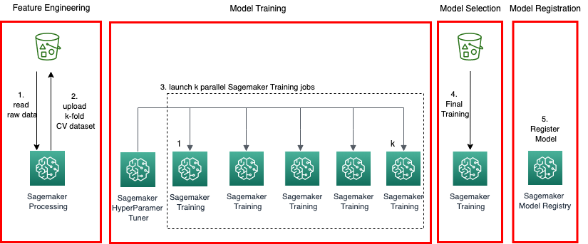
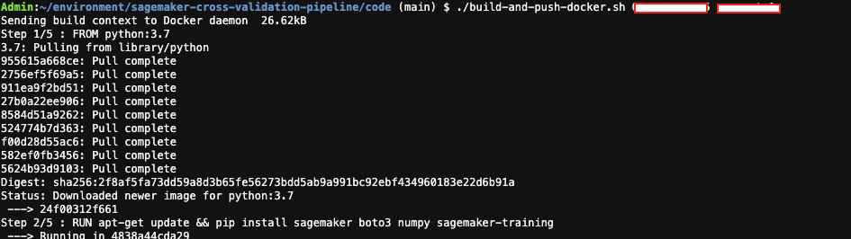
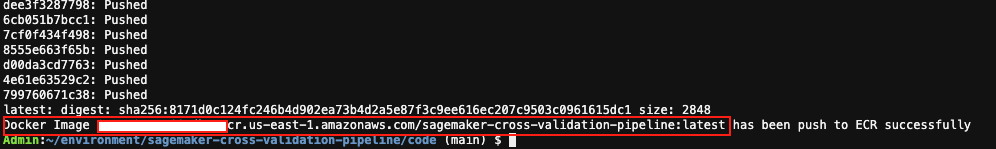
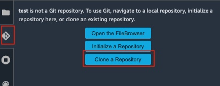
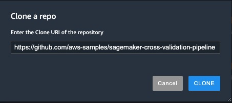
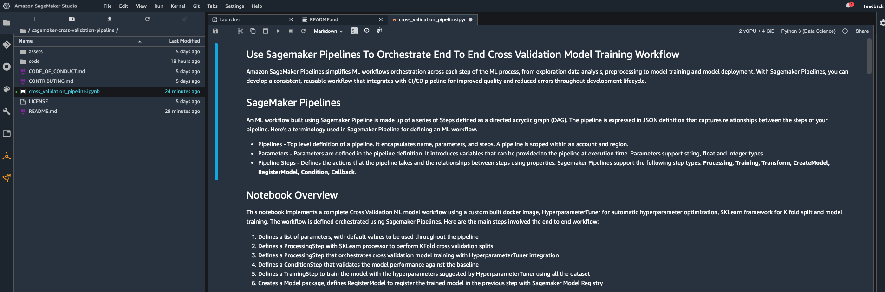
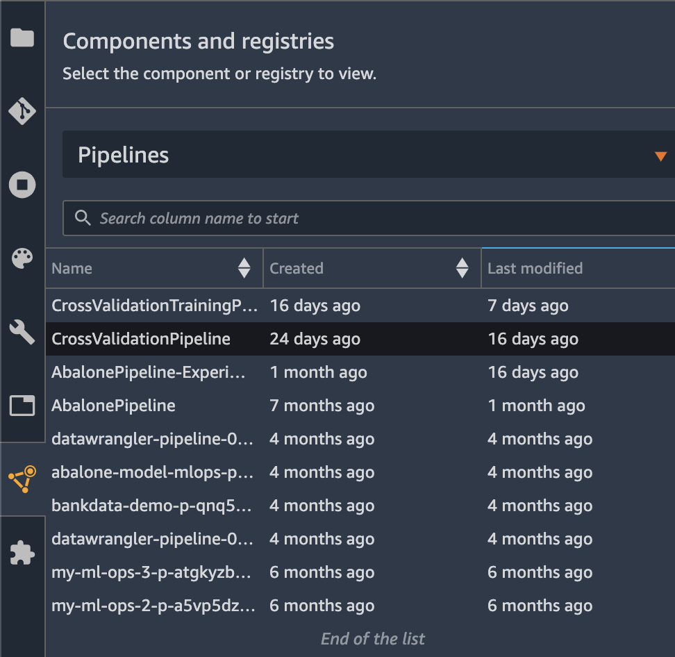
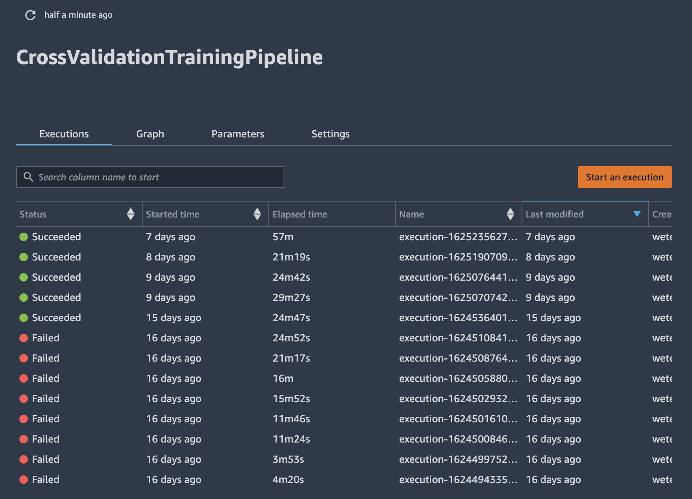
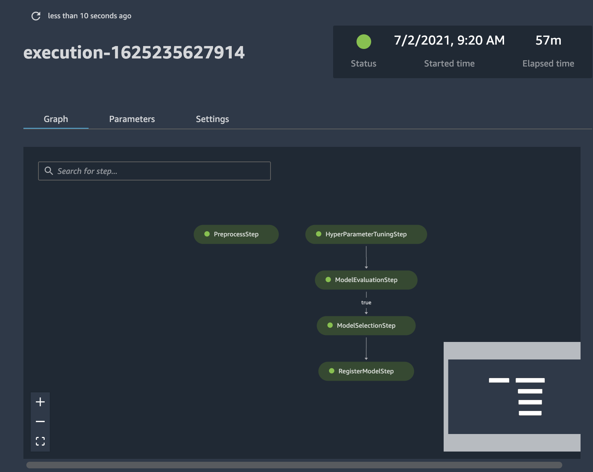

# Build a Highly Scalable Cross Validation Training Pipeline With Sagemaker
This repository contains source code and a jupyter notebook that triggers the cross validation training pipeline using Sagemaker Pipeline. 


## Goals
This main goal of this project is to provide a reference implementation for building a cross validation training pipeline with Amazon Sagemaker. By running the supplement juypter notebook provided in this project, you would have built a cross validation training pipeline that integrates with [Sagemaker Pipelines](https://aws.amazon.com/sagemaker/pipelines/) and [Sagemaker Automatic Model Tuning](https://docs.aws.amazon.com/sagemaker/latest/dg/automatic-model-tuning.html). Typically, training cross validation models involve k fold models trained in sequence, usually performed on the same server. In this project, we implement a technique that leverages Sagemaker SDK, Sagemaker Hyperparameter Tuner and Sagemaker Training Jobs to train k fold models in parallel to improve scalability and performance.

This project leverages a custom docker container. The specific steps on integrating a custom docker container are detailed in the next few sections below.

## Architecture


## License
This library is licensed under the MIT-0 License. See the LICENSE file.

<details>
<summary>  
<b>External Dependencies</b>

This package depends on and may retrieve a number of third-party software packages (such as open source packages) from third-party servers at install-time or build-time ("External Dependencies"). The External Dependencies are subject to license terms that you must accept in order to use this package. If you do not accept all of the applicable license terms, you should not use this package. We recommend that you consult your company’s open source approval policy before proceeding.

</summary>
Provided below is a list of the External Dependencies and the applicable license terms as indicated by the documentation associated with the External Dependencies as of Amazon's most recent review of such documentation.
THIS INFORMATION IS PROVIDED FOR CONVENIENCE ONLY. AMAZON DOES NOT PROMISE THAT THE LIST OR THE APPLICABLE TERMS AND CONDITIONS ARE COMPLETE, ACCURATE, OR UP-TO-DATE, AND AMAZON WILL HAVE NO LIABILITY FOR ANY INACCURACIES. YOU SHOULD CONSULT THE DOWNLOAD SITES FOR THE EXTERNAL DEPENDENCIES FOR THE MOST COMPLETE AND UP-TO-DATE LICENSING INFORMATION.
YOUR USE OF THE EXTERNAL DEPENDENCIES IS AT YOUR SOLE RISK. IN NO EVENT WILL AMAZON BE LIABLE FOR ANY DAMAGES, INCLUDING WITHOUT LIMITATION ANY DIRECT, INDIRECT, CONSEQUENTIAL, SPECIAL, INCIDENTAL, OR PUNITIVE DAMAGES (INCLUDING FOR ANY LOSS OF GOODWILL, BUSINESS INTERRUPTION, LOST PROFITS OR DATA, OR COMPUTER FAILURE OR MALFUNCTION) ARISING FROM OR RELATING TO THE EXTERNAL DEPENDENCIES, HOWEVER CAUSED AND REGARDLESS OF THE THEORY OF LIABILITY, EVEN IF AMAZON HAS BEEN ADVISED OF THE POSSIBILITY OF SUCH DAMAGES. THESE LIMITATIONS AND DISCLAIMERS APPLY EXCEPT TO THE EXTENT PROHIBITED BY APPLICABLE LAW.

** sklearn; version 0.22.1 -- https://scikit-learn.org
</details>

## Prerequisites
- Sagemaker Studio
- CLI Terminal that supports building docker images. (e.g. [AWS Cloud9]{https://aws.amazon.com/cloud9/))

## Step 1 - Build A Docker Image
In a CLI terminal that supports building docker image, run the following commands: (replace aws_acct_id and aws_region to reflect the target environment where the training jobs should be run)

```
git clone https://github.com/aws-samples/sagemaker-cross-validation-pipeline
cd sagemaker-cross-validation-pipeline/code
./build-and-push-docker.sh [aws_acct_id] [aws_region]
```

**Note:** Sagemaker Studio Terminal does not support building docker images today. Therefore, you would need to run the docker image building script outside of Sagemaker Studio that supports docker. For example, [AWS Cloud9](https://aws.amazon.com/cloud9/). 

Capture the ECR repository URI from the script after a successful run. You'll need to provide the image URI at pipeline execution time. Here's a sample format of a ECR repo UR: ############.dkr.ecr.us-east-2.amazonaws.com/sagemaker-cross-validation-pipeline:latest. Following are 2 screenshots about building the docker image and capturing the docker image information:




## Step 2 - Launch Sagemaker Studio

1. Launch Sagemaker Studio with a valid user
2. Clone this repo into a Sagemaker studio workspace, as followed:


3. Navigate to the repository folder cloned in previous step, open the [jupyter notebook](cross_validation_pipeline.ipynb). Choose **Python3 (Data Science)** kernel, and **ml.t3.medium** instance type if not selected by default, as shown in the following:


## Step 2 - Update Pipeline Parameters
Following items are a list of variables used in pipeline definition. These values can be overwritten at pipeline execution time for different results. 

- **ProcessingInstanceCount** - number of instances for a Sagemaker Processing job in prepropcessing step.
- **ProcessingInstanceType**  - instance type used for a Sagemaker Processing job in prepropcessing step.
- **TrainingInstanceType** -  instance type used for Sagemaker Training job.
- **TrainingInstanceCount** -  number of instances for a Sagemaker Training job.
- **InferenceInstanceType** - instance type for hosting the deployment of the Sagemaker trained model.
- **HPOTunerScriptInstanceType** - instance type for the script processor that triggers the hyperparameter tuning job 
- **ModelApprovalStatus** - the initial approval status for the trained model in Sagemaker Model Registry
- **ExecutionRole** - IAM role to use throughout the specific pipeline execution. 
- **DefaultS3Bucket** - default S3 bucket name as the object storage for the target pipeline execution.
- **BaselineModelObjectiveValue** - the minimum objective metrics used for model evaluation.
- **S3BucketPrefix** - bucket prefix for the pipeline execution.
- **ImageURI** - docker image URI (ECR) for triggering cross validation model training with HyperparameterTuner.
- **KFold** - the value of k to be used in k fold cross validation
- **MaxTrainingJobs** - maximum number of model training jobs to trigger in a single hyperparameter tuner job.
- **MaxParallelTrainingJobs** - maximum number of parallel model training jobs to trigger in a single hyperparameter tuner job.
- **MinimumC, MaximumC** - Hyperparameter ranges for SVM 'c' parameter.
- **MimimumGamma, MaximumGamma** - Hyperparameter ranges for SVM 'gamma' parameter. 

To update any variables, navigate towards the bottom of the notebook where the pipeline execution is triggered and update the parameters with the desired values:

```
execution = pipeline.start(
    parameters=dict(
        BaselineModelObjectiveValue=0.8,
        MinimumC=0,
        MaximumC=1,
        ImageURI="############.dkr.ecr.us-east-2.amazonaws.com/sagemaker-cross-validation-pipeline:latest"
    ))
```

**Important Note** You must replace the *ImageURI* with the docker image URI that was built and pushed to ECR as described in Step 1

## Step 3 - Trigger Pipeline Run
Execute all cells in the notebook from the beginning. As prerequistes, select **Python 3 (Data Science)** jupyter kernel if not selected by default. This notebook has been tested successfully in Sagemaker Studio with **2vCPU + 4GiB** instance type. Additionally, you can visualize the pipeline execution in realtime using Sagemaker Pipelines user interface available in the left hand panel in Sagemaker Studio console.



You can track the status of pipeline execution directly from the pipeline dashboard:



To drill down to specific job, double click the execution from the dashboard:




